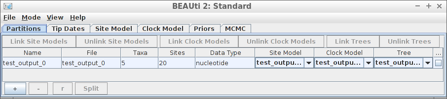

# babette_example_1

Branch   |[](https://travis-ci.org)                                                                                               |[](https://appveyor.com)                                                                                               
---------|------------------------------------------------------------------------------------------------------------------------------------------------------------|--------------------------------------------------------------------------------------------------------------------------------------------------------------------------------------------
`master` |[](https://travis-ci.org/richelbilderbeek/babette_example_1) |[](https://ci.appveyor.com/project/richelbilderbeek/babette-example-1/branch/master)
`develop`|[](https://travis-ci.org/richelbilderbeek/babette_example_1)|[](https://ci.appveyor.com/project/richelbilderbeek/babette-example-1/branch/develop)

A [babette example](https://github.com/richelbilderbeek/babette_examples).

## Example #1: all default

Using all default settings, only specify a DNA alignment.



```
fasta_filename <- "primates.fas"
save_nexus_as_fasta(
  nexus_filename = beastier::get_beast2_example_filename("Primates.nex"),
  fasta_filename = fasta_filename
)

inference_results <- bbt_run(
  fasta_filename = fasta_filename
)
```

All other parameters are set to their defaults, as in BEAUti.

## Result


